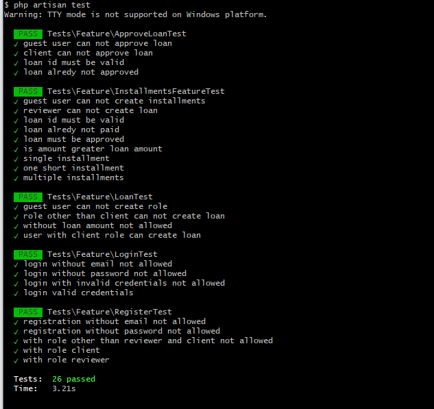

## About

This project is test task for ASPIREAPP. Basically, Cleint and reviewer can regiter, Client can generate loan and reviewer can approve it and client can pay loan via installments

## Repayment condition checks

## Feature Test cases

## Installation

1. run **composer update**

2. **Set database credentials in env file\***

3. **Create Database with name test for testing**

4. **Set Test databse credentials in phpunit.xml**

5. run **php artisan migrate:fresh --seed**

6. run **php artisan serve**

## How to Use

1. Hit **Register** & **Login** endpoints,token will be recieved for `Authorization` header, for postman, variables as `$reviewerToken` and `$clientToken` respectively to make subsequent authenticated requests

2. Hit **CreateLoan** endpoint. By default, the loan status will be set as `PENDING`

3. Reviewers can update the status using **ApproveLoan**

4. **CreateInstallments** endpoint is used to pay for the installments

## Postman Collection

Download Postman Collection, [click here.](https://www.getpostman.com/collections/f8b0e1759d0e8adcfd43)
in case of link is working: Json collection is added at root level

## Test

Feature test is added. databse with name **test** must be created to test. **Set Test databse credentials in phpunit.xml**

## License

Feel free to use this however you want.
